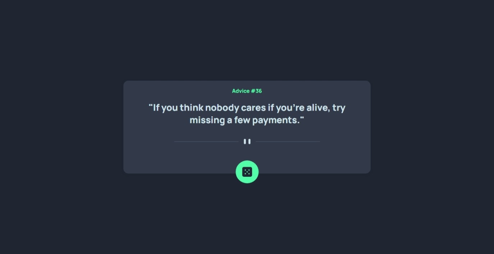

# Frontend Mentor - Advice generator app solution

This is a solution to the [Advice generator app challenge on Frontend Mentor](https://www.frontendmentor.io/challenges/advice-generator-app-QdUG-13db).  

## Table of contents

- [Overview](#overview)
  - [The challenge](#the-challenge)
  - [Links](#links)
  - [Screenshot](#screenshot)
- [My process](#my-process)
  - [What I learned](#what-i-learned)

## Overview

### The challenge

Users should be able to:

- View the optimal layout for the app depending on their device's screen size
- See hover states for all interactive elements on the page
- Generate a new piece of advice by clicking the dice icon

### Links

- [Live Site URL](https://xdv99.github.io/Frontend-Mentor-advice-generator-app/)

### Screenshot

|  |  |
|:-----------------------:|:-----------------------:|
|     Desktop Design  |    Mobile Design  |


## My process

### What I learned

Using **JavaScript Fetch** is pretty useful to update the UI with data from API.
```js
function getAdvice () {
    fetch('https://api.adviceslip.com/advice').then(res => res.json()).then(res => {
        const advId = res.slip.id;    
        const advice = res.slip.advice;
        adviceId.textContent = `Advice #${advId}`;
        adviceContent.textContent = `"${advice}"`;
    });
}
```
